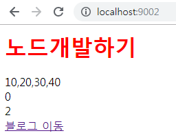

## 웹서버
- 웹 : 누구나 사용
- 앱 : 고유한 디바이스 (ex.휴대폰)

### HTTP 1.1
- 1997년 출시
- 기본컨셉 : request 와 response
> request : user가 줌 / response : 내가(서버) 줌
- 많은 브라우저들이 1.1에 맞춰져있어 2.0은 잘 쓰지않음

### 웹서버 설치
- 응답이 없으면 무한루프에 빠짐

app.js
```
var http = require('http');
```
> 변수로 감싸 http 객체로 만듬 (http는 모듈화를 시켜놓아서 ./ 가 필요없음)
```
http.createServer(function(req,res){
  console.log(req);
  res.end('hello world');
}).listen(9001)
```
> 9001 포트에 접속하면 응답(hello world)을 볼 수 있음
- `listen() : 서버를 만들어서 대기(listen)시킴` (누군가 접속할테니까)
- `port : 서버에 들어갈 수 있는 문` (생략하고 들어가는건 무조건 국제표준 80포트<br />1~1000까지는 거의 예약포트이므로 사용하지 않는게 좋음
```
node app.js
```
> 서버실행
- 접속
```
localhost:9001
```
>화면에는 응답한 hello world가 보이고 터미널에는 request에 대한 정보를 보여줌(접속경로, ip, 브라우저...)
- `runtime : 실행 중`

### supervisor
- 서버 자동관리
- 코드가 수정되면 자동으로 서버를 새로고침해줌
- 단, 글로벌 설치만 가능 (한번만 설치하면 계속 사용가능)
- 코드를 수정하면 서버를 죽였다가 다시 띄워야 하는 귀찮음을 해결
```
npm install supervisor -g
```
```
supervisor *.js
```

### 프레임워크 와 라이브러리
- 프레임워크 : 주어진 틀대로 개발하게끔 도와주는 것 (express)
> 웹을 개발하기위한 툴을 제공
- 라이브러리 : 조합을해서 개발하는 것 (jquery)

### 변수
- var : 함수 단위
- let : 블럭 단위
- const : 상수 (변경 불가능)

## express
- [express npm](https://www.npmjs.com/package/express) : 앱스토어와 같은 개념
- app.js는 javascript로 개발하는 느낌 server.js는 jquery로 개발하는 느낌

server.js
```
npm install express --save
```
> express 설치
```
const express = require('express');
```
> express 가져오기
```
const app = express();

// const express = require('express')();
```
> 주석부분과 같지만 가독성을 위해 변수 app으로 만듬
```
app.listen(9002);
```
> 포트설정
#### 라우트
- 최상단 접속, 갈래길이 갈라지는 곳
- 통신메소드 : GET(조회), POST(입력), PUT(수정), DELETE(삭제)
- 처음에 주소치고 들어오는건 무조건 GET
```
app.get('/', (req,res)=>{
  console.log('a');
  res.send('hi');
});
```
```
supervisor server.js
```
> 서버실행
- 접속
```
localhost:9002
```
> 터미널에는 a 가 찍히고 화면에는 응답 hi가 출력

#### 루트경로
- /
- 첫화면, 시작경로, 최상단 루트
- 생략가능
> 사실상 localhost:9002/ 으로 슬래시가 생략된 것

```
app.get('/', (req,res)=>{
  res.send('<a href="/blog">블로그 이동</a>');
});

app.get('/blog', (req,res)=>{
  res.send('<a href="/">메인 이동</a>');
})
```
> 메인 화면에서 블로그로 이동을 누르면 localhost:9002/blog로 이동되고 블로그 화면에서 메인 이동을 누르면 localhost:9002로 이동됨 

### 파일연결
index.html
```
<html>
<head>
  <meta charset="UTF-8">
  <title></title>
</head>
<body>
  <a href="/blog">블로그 이동</a>
</body>
</html>
```
server.js
```
app.get('/', (req,res)=>{
  res.sendFile('C:/Users/Administrator/Desktop/admy/1006/index.html');
});
```
> 절대경로를 써줘야함
- 해결
```
const path = require('path');
```
> 파일의 path를 알아서 찾아줌
```
res.sendFile(path.join(__dirname+'/index.html'));
```
> 동일하게 실행됨
- `join : 합쳐줌`
#### path 와 __dirname
- `path : 현재 경로를 알려줌` 1006의 path (C:~/1006)
- `__dirname : 현재 폴더 기준의 path` 1006 안에 path (1006/~)
```
console.log(path);
```
> 터미널 확인
```
console.log(__dirname);
```
> C:/Users/Administrator/Desktop/admy/1006

## 템플릿엔진
- node는 웹을 위한 언어가 아니라서 친절하지 않음 그래서 sendfile은 데이터를 보낼 수 없음<br />하지만 render는 가능해서 템플릿엔진을 이용함
```
npm install ejs --save
```
> 템플릿엔진 ejs 설치
```
app.set('views');
app.set('view engine','ejs');
```
> 엔진 세팅<br />views 폴더를 루트폴더( / )로 정함
```
app.use(express.static('public'));
```
> 미들웨어 적용<br />정적파일을 모아놓는 폴더를 public으로 만들었다는 것을 알려줌
```
app.get('/', (req,res)=>{
  res.render('index',{
    title : '노드개발하기',
    number : [10, 20, 30, 40]
  });
});
```
> render를 이용해 데이터 보내주기
### ejs
- 확장자는 ejs
- 열고 닫을 때 <% %> 를 이용
- 반드시 views 폴더에 파일을 넣을 것

views/index.ejs
```
<html>
<head>
  <meta charset="UTF-8">
  <title></title>
  <link rel="stylesheet" href="/style.css">
</head>
<body>

  <h1><%= title %></h1>
  <div><%= number %></div>
  <% for(var i = 0; i < 3; i++) { %>
    <% if ( i != 1 ) { %>
      <div><%= i %></div>
    <% } %>
  <% } %>
  <a href="/blog">블로그 이동</a>

</body>
</html>
```
> css 위치도 public으로 루트경로가 적용되어 모든 정적파일의 루트경로가 됨

public/style.css
```
h1 { color:red; }
```
> 정적파일은 public에 위치
- 결과


> css적용, 데이터전달, ejs를 이용한 for문 사용, html
